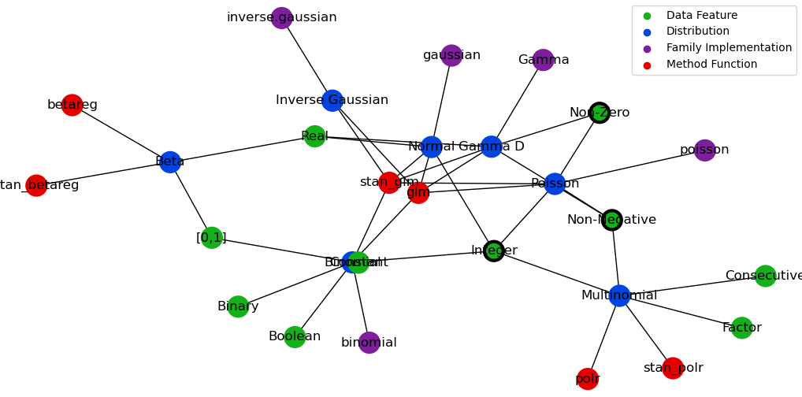

Graph-State-Machine
===================

.. image:: https://img.shields.io/pypi/v/Graph-State-Machine.svg
    :target: https://pypi.python.org/pypi/Graph-State-Machine/
    :alt: Latest PyPI version

.. image:: https://img.shields.io/pypi/pyversions/Graph-State-Machine.svg
    :target: https://pypi.python.org/pypi/Graph-State-Machine/
    :alt: Python Versions

.. image:: https://github.com/T-Flet/Graph-State-Machine/workflows/Python%20package/badge.svg
    :target: https://github.com/T-Flet/Graph-State-Machine/actions?query=workflow%3A%22Python+package%22
    :alt: Build

.. image:: https://img.shields.io/pypi/l/Graph-State-Machine.svg
    :target: https://github.com/T-Flet/Graph-State-Machine/blob/master/LICENSE
    :alt: License

A simple framework for building easily interpretable computational constructs between a graph automaton and a Turing machine where states are combinations of a graph's (typed) nodes; an example use would be as transparent backend logic by pathing through an ontology.

Installation
------------

::

    pip install Graph_State_Machine

Description
-----------

This package implements a computational construct which is essentially a finite state machine over a graph, where states are node combinations and where the transition function is arbitrary.
(Note that this last arbitrariness makes the system Turing complete since it allows implementing a Turing machine with it)

Given a graph with nodes which have types and a state (e.g. a list of nodes), the construct applies two functions to perform a step:

- A function to scan the graph "around" the state possibly by node type (quotes since this definition is up to the user; neighbouring nodes is an example) and return a scored (and thus ordered) list of candidate nodes to "add" to the state (again, quotes because the processing is arbitrary)
- A function to process the scan result and thus update the state AND possibly the graph itself (hence Turing completeness)

Besides pure academic exploration of the construct, some possible uses of it are:
- implementing backend logics which are best represented by graphs, e.g. an "expert system"
- pathing through ontologies by entity nearness, e.g. building a sentence out of a word ontology

Design
------

(Inspecting the package __init__.py imports is a quick and useful exercise in understanding the overall structure, while the following is a less concise version of the content of types.py)

The main class exported by this package is :code:`GSM`, whose constructor accepts the following arguments:

- A :code:`Graph`: a graph object with typed nodes built around a Networkx Graph, with utility methods so that it can

        - be built from shorthand notation (structured edge lists)
        - check its own consistency
        - self-display
        - extend itself by joining up with another with common nodes (exact ontology matching)
- A :code:`State`: the initial state; the default type is a simple list of nodes (strings), but it can be anything as long as:

    - the used :code:`Scanner` function is designed to handle it
    - a function to extract a list of strings from it is provided as the :code:`selector` argument
- A :code:`Scanner` (:code:`Graph -> List[Node] -> Optional[NodeType] -> List[Tuple[Node, Any]]`): a function taking in a list of state nodes to use to determine next-step candidates, optionally focussing only on a specific node type
- An :code:`Updater` (:code:`State -> Graph -> ScanResult -> Tuple[State, Graph]`): a function taking in the current state and graph along with the result of a node scan and returns the updated state and graph (the graph is likely not going to be modified in most cases, but the facility is there for Turing completeness)
- A :code:`Selector` (:code:`State -> List[Node]`): a function to extract from the state the list of nodes which should be fed to the :code:`Scanner`

Note: given that the :code:`Graph` wraps a Networkx Graph, arbitrary node and edge attributes can be used to enhance the processing functions.

A simple example of node-list state with non-identity :code:`Selector` is a :code:`GSM` which only takes the last "visited" node into account (just set the selector to :code:`last_only`).

Going one step further, an intuitive example of :code:`State` which is not a simple list of nodes is a dictionary of lists of nodes only some subsets of which are considered for graph exploration (and others for state updating), e.g. keeping track of which nodes were initial state and which ones were added by steps.
Simple default constructor functions for this :code:`State` type are provided:
:code:`dict_fields_getter` (for :code:`selector`), which takes in the list of fields to concatenate, and :code:`list_in_dict_accumulator` (for :code:`Updater`), which takes in the single field to update.

Simple Example
--------------

A GSM which determines the appropriate R linear regression function and distribution family from labelled data features:

- Define a numerical data-type ontology graph in the typed edge-list shorthand which :code:`Graph` accepts along with ready-made Networkx graphs, making use of two simple notation helper functions
- Create a default-settings :code:`GSM` with it and a simple starting state
- Ask it to perform steps focussing on the node types of 'Distribution', 'Method Function' and 'Family Implementation', which in this context just means finding the most appropriate of each

::

    from Graph_State_Machine.gsm import Graph, GSM
    from Graph_State_Machine.Util.misc import adjacencies_lossy_reverse, strs_as_keys

    _shorthand_graph = {
        'Distribution': {
            'Normal': ['stan_glm', 'glm', 'gaussian'],
            'Binomial': ['stan_glm', 'glm', 'binomial'],
            'Multinomial': ['stan_polr', 'polr'],
            'Poisson': ['stan_glm', 'glm', 'poisson'],
            'Beta': ['stan_betareg', 'betareg'],
            'Gamma D': ['stan_glm', 'glm', 'Gamma'],
            'Inverse Gaussian': ['stan_glm', 'glm', 'inverse.gaussian']
        },
        'Family Implementation': strs_as_keys(['binomial', 'poisson', 'Gamma', 'gaussian', 'inverse.gaussian']),
        'Method Function': strs_as_keys(['glm', 'betareg', 'polr', 'stan_glm', 'stan_betareg', 'stan_polr']),
        'Data Feature': dict(
            {'Constant': []},
            **adjacencies_lossy_reverse({ # Reverse-direction definition here since more readable i.e. defining the contents of the lists
                'Binomial': ['Binary', 'Integer', '[0,1]', 'Boolean'],
                'Poisson': ['Non-Negative', 'Integer', 'Non-Zero'],
                'Multinomial': ['Factor', 'Consecutive', 'Non-Negative', 'Integer'],
                'Normal': ['Integer', 'Real'],
                'Beta': ['Real', '[0,1]'],
                'Gamma D': ['Non-Negative', 'Real', 'Non-Zero']
            })
        )
    }

    gsm = GSM(Graph(_shorthand_graph), ['Non-Negative', 'Non-Zero', 'Integer']) # Default function-arguments

    gsm.plot()

    gsm.consecutive_steps(['Distribution', 'Family Implementation']) # Perform 2 steps
    print(gsm._step_res('Method Function')) # Peek at intermediate value of new a step
    gsm.step('Method Function') # Perform the step
    gsm.step('NON EXISTING TYPE') # Trigger a warning and no State changes

    print(gsm)

In particular, the 'Method Function' scan result is performed separately while peeking at the scan result to show that there is a tie between a Frequentist and a Bayesian method.
This is a trivial example (in that the simple addition could have been there from the beginning) of where a broader graph could be attached by :code:`gsm.extend_with(...)` and new state introduced in order to resolve the tie.

Note that ties need not really be resolved as long as the :code:`Updater` function's behaviour is what the user expects since it is not limited in functionality; it could select a random option, all, some or none of them, or it could adjust the graph itself or terminate execution.

