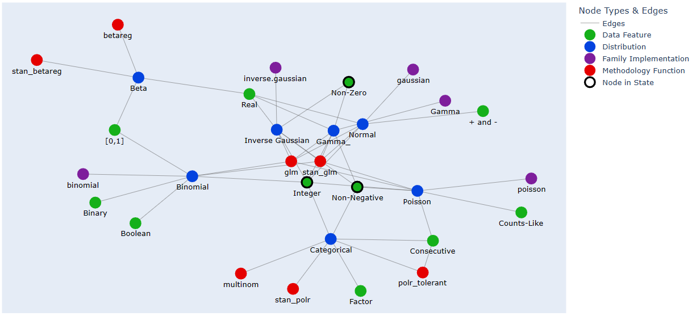
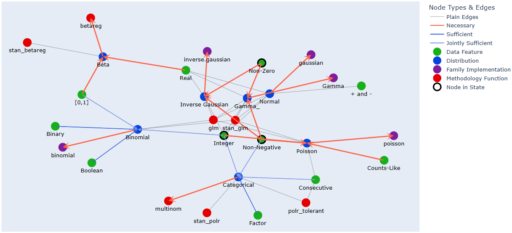

Graph-State-Machine
===================

.. image:: https://img.shields.io/pypi/v/Graph-State-Machine.svg
    :target: https://pypi.python.org/pypi/Graph-State-Machine/
    :alt: Latest PyPI version

.. image:: https://pepy.tech/badge/Graph-State-Machine
    :target: https://pepy.tech/project/Graph-State-Machine
    :alt: Package Downloads

.. image:: https://img.shields.io/pypi/pyversions/Graph-State-Machine.svg
    :target: https://pypi.python.org/pypi/Graph-State-Machine/
    :alt: Python Versions

.. image:: https://github.com/T-Flet/Graph-State-Machine/workflows/Python%20package/badge.svg
    :target: https://github.com/T-Flet/Graph-State-Machine/actions?query=workflow%3A%22Python+package%22
    :alt: Build

.. image:: https://img.shields.io/pypi/l/Graph-State-Machine.svg
    :target: https://github.com/T-Flet/Graph-State-Machine/blob/master/LICENSE
    :alt: License

A simple library to build easily interpretable computational constructs similar to Turing machines
over graphs, where states can be (but are not limited to) combinations of a graph's (typed) nodes;
an example use would be a transparent backend logic which navigates a network of sub-states

Installation
------------

::

    pip install Graph_State_Machine

Description
-----------

This package implements a computational construct similar to a Turing machine over a graph,
where states are typically node combinations (state objects can be arbitrary) and where the arbitrary
transition function can update both state and graph.
Note that this last arbitrariness makes the system Turing complete since it allows implementing
a Turing machine with it (achieved by defining the graph to be a linear array and the state as a tuple
of node name and "head" state).

Given a graph with typed nodes and a state object from which a list of nodes can be extracted
(by an optional :code:`Selector` function), the construct applies two arbitrary functions to perform a step:

:code:`Scanner`
  A generalised neighbourhood function, which scans the graph "around" the state nodes and returns a scored
  list of nodes for further processing; additional and optional arguments can be included, e.g. to filter by type
:code:`Updater`
  A function to process the scan result and thus update the state and possibly the graph itself

    Schematic representation of a GSM step (with data flow in dashed arrows)

This computational construct is different from a finite state machine on a graph and from a
graph cellular automaton, but it shares some similarities with both in that it generalises some of
their features for the benefit of human ease of design and readability.
For example, a :code:`GSM`'s graph
generalises a finite state machine’s state graph by allowing the combinations of nodes to represent
state, and the scanner function is just a generalisation of a graph cellular automaton’s neighbourhood
function in both domain and codomain.
As previously mentioned, it is closer to a Turing machine on
a graph than either of the above, one whose programming is split between the internal state rules
and the graph topology, thus allowing programs to be simpler and with a more easily readable state.

Said graph topology can be further enriched/simplified by the presence of arbitrary information in the form of
node or edge attributes, which can then be used by arbitrary step rules;
an example of this are attributes representing necessity and sufficiency of those links.

Besides pure academic exploration of the construct, some uses for it are
implementing backend logics which are best represented by graphs (e.g. an "expert system"),
or pathing through ontologies by entity proximity or similarity.

Design
------

(Inspecting the package __init__.py imports is a quick and useful exercise in understanding the overall structure, while the following is a less concise version of the content of types.py)

Formalising the above description using library terminology, the constructor of the main class
(:code:`GSM`) takes the following arguments:

:code:`Graph`
  A graph object with typed nodes (wrapping a NetworkX graph),
  with utility methods so that it can be built from shorthand
  notation (structured edge lists), check its own consistency, self-display and extend itself by
  joining up with another with common nodes (exact ontology matching)
:code:`State`
  The initial state; the default type is a simple list of nodes (strings), but it can be anything as
  long as the used :code:`Scanner` function is designed to handle it and a function to extract a list of
  strings from it is provided as the Selector argument
:code:`Scanner` (:code:`Graph -> List[Node] -> ... -> List[Tuple[Node, Any]]`)
  A function taking in a list of state nodes to use to determine next-step candidates;
  arbitrary additional arguments, optional or required, may be present after Graph and List[Node],
  for example focussing the scan on specific node types;
  these extra arguments can be passed through the step methods either named (dictionary) or unnamed (list)
:code:`Updater` (:code:`State -> Graph -> ScanResult -> Tuple[State, Graph]`)
  A function taking in the current
  state and graph along with the result of a node scan and returns the updated state and graph
:code:`Selector` (:code:`State -> List[Node]`)
  A function to extract from the state the list of nodes which should
  be fed to the Scanner

A simple example of node-list state with non-identity Selector is a :code:`GSM` which only takes the last
"visited" node into account, and going one step further, an intuitive example of :code:`State` which is not
a simple node-list is a dictionary of node-lists only some subsets of which are considered for graph
exploration (and others for state updating), e.g. keeping track of which nodes were initial state and
which ones were added by steps.

Simple default constructor functions for this :code:`State` type are provided:
:code:`dict_fields_getter` (for :code:`selector`), which takes in the list of fields to concatenate, and :code:`list_in_dict_accumulator` (for :code:`Updater`), which takes in the single field to update.

Since the underlying object is a NetworkX graph, the wide variety of functionality that library provides can easily
be made use of,
but, as previously mentioned, even simply adding arbitrary node and edge attributes can greatly enhance/simplfy a GSM's
processing.
For example, necessity and sufficiency relationships are a reasonable addition to the graph for typical usecases,
therefore support for them is built into the provided :code:`Scanner` functions, graph creation shorthand and
plotting method(s).

Graph Creation Shorthand
------------------------

Graphs can be created quickly by letting the :code:`Graph` class constructor directly parse a specific format of
typed adjacency list, one with Python type signature
:code:`Dict[NodeType, Dict[Node, Union[List[Node], Dict[str, List[Union[Node, List[Node]]]]]]]`
(:code:`Node` and :code:`NodeType` are just convenient aliases for :code:`str`)
and following this structure:

::

    dict(
        NodeType = dict(
            Node = <NODES TO WHICH THERE IS AN EDGE>,
            ...
        ),
        ...
    )

where :code:`<NODES TO WHICH THERE IS AN EDGE>` can be:

- an empty list: no edges to the base node are being declared at this point (but could be declared from the node at the other end)
- a list of :code:`Node`-s
- [If the intention is to have necessity and sufficiency relationships] a dictionary of lists of :code:`Node`-s, with possible entries:

        ::

            necessary_for: nodes for which the base node is necessary
            sufficient_for: nodes for which the base node is sufficient
            are_necessary: nodes which are necessary for the base node
            are_sufficient: nodes OR LISTS OF NODES which are individually or jointly sufficient for the base node
            plain: nodes which share and edge with the base node without necessity or sufficiency relationships (at least not declared here)

The structure checks that every node is declared as of some type,
and it identifies redundancies and clashes, respectively raising warnings and errors.
These checks granted, edges and necessity/sufficiency relationships can be added at either node declaration.

Convenience Functions
^^^^^^^^^^^^^^^^^^^^^

Two convenience functions are provided for writing the inner dictionaries of the typed adjacency list more naturally:

- :code:`strs_as_keys`: given a list of :code:`Node`-s (strings), create a dictionary of empty lists with them as keys;
  for batch declaration of nodes without (for the moment) declared edges.
  Schematic example: :code:`[A, B] -> {A: [], B: []}`

- :code:`reverse_adjacencies`: given a :code:`<NODES TO WHICH THERE IS AN EDGE>`, return the reverse-direction
  :code:`<NODES TO WHICH THERE IS AN EDGE>`, possibly losing singletons and joint-sufficiency relationships
  (:code:`allow_losing_singletons` and :code:`allow_losing_joint_sufficiency` arguments are :code:`False` by default,
  raising exceptions to prevent losses).
  This is useful when it is more natural to declare nodes of a specific type as the endpoint of edges
  from other nodes (perhaps of mixed types);
  e.g. when the node type in question is semantically a feature or qualifier applicable to more than one kind of entity
  (like :code:`'Data Features'` in the exaple below).
  Schematic example: :code:`{A: [B, C], D: []} -> {B: [A], C: [A]}`

Note on Necessity & Sufficiency
^^^^^^^^^^^^^^^^^^^^^^^^^^^^^^^

Use of necessity and sufficiency attributes is on by default in the provided :code:`Scanner` functions,
and a detailed warning is produced if possibly problematic graph features occur,
but for the sake of user customisation, experimentation and debugging,
support for each can be turned off separately by setting the :code:`Scanner`-s' :code:`check_necessity` and/or :code:`check_sufficiency`
arguments to :code:`False` (either when constructing the :code:`GSM` or individually at each :code:`GSM.step` call).

(The warning will appear if required and contains more details, but the gist of the possible issue is that
the presence of neither-necessary-nor-sufficient neighbours of a candidate node in the state
does not protect against the absence of sufficient ones).

Simple Example
--------------

A small GSM which selects the appropriate R linear regression function and distribution family from labelled data features:

- Define a numerical data-type ontology graph in the typed edge-list shorthand which :code:`Graph` accepts along with ready-made Networkx graphs, making use of two simple notation helper functions
- Create a default-settings :code:`GSM` with it and a simple starting state
- Ask it to perform steps focussing on the node types of 'Distribution', 'Methodology Function' and 'Family Implementation', which in this context just means finding the most appropriate of each

    Default plot: gsm.plot()

.. code-block:: Python

    from Graph_State_Machine import *

    _shorthand_graph = {
        'Distribution': {
            'Normal': ['stan_glm', 'glm', 'gaussian'],
            'Binomial': ['stan_glm', 'glm', 'binomial'],
            'Categorical': ['stan_polr', 'polr_tolerant', 'multinom'],
            'Poisson': ['stan_glm', 'glm', 'poisson'],
            'Beta': ['stan_betareg', 'betareg'],
            'Gamma_': ['stan_glm', 'glm', 'Gamma'],
            'Inverse Gaussian': ['stan_glm', 'glm', 'inverse.gaussian']
        },
        'Family Implementation': strs_as_keys(['binomial', 'poisson', 'Gamma', 'gaussian', 'inverse.gaussian']),
        'Methodology Function': strs_as_keys(['glm', 'betareg', 'polr_tolerant', 'multinom', 'stan_glm', 'stan_betareg', 'stan_polr']),
        'Data Feature': reverse_adjacencies({ # Reverse-direction definition here since more readable i.e. defining the contents of the lists
            'Binomial': ['Binary', 'Integer', '[0,1]', 'Boolean'],
            'Poisson': ['Non-Negative', 'Integer', 'Consecutive', 'Counts-Like'],
            'Categorical': ['Factor', 'Consecutive', 'Non-Negative', 'Integer'],
            'Normal': ['Integer', 'Real', '+ and -'],
            'Beta': ['Real', '[0,1]'],
            'Gamma_': ['Non-Negative', 'Integer', 'Real', 'Non-Zero'],
            'Inverse Gaussian': ['Non-Negative', 'Integer', 'Real', 'Non-Zero'],
            'polr_tolerant': ['Consecutive']
        })
    }

    gsm = GSM(Graph(_shorthand_graph), ['Non-Negative', 'Non-Zero', 'Integer']) # Using default arguments
        # The default node_scanner is by jaccard similarity score, and takes additional arguments to filter candidates
        # and their neighbours by type; only the first one (candidate type list) is used in the examples below

    gsm.plot()
    # import networkx as nx
    # gsm.plot(layout = nx.shell_layout, radial_labels = True) # Some other layout
    # gsm.plot(plotly = False, show_necessity = False, show_sufficiency = True) # Networkx's native plotting backend instead of Plotly

    gsm.consecutive_steps(dict(candidate_types = ['Distribution']), dict(candidate_types = ['Family Implementation']))
        # Perform 2 steps, providing named arguments (in this case only one) to the Scanner function as a dictionary

    # gsm.consecutive_steps([['Distribution']], [['Family Implementation']]) # Unnamed-arguments version of the above
    # gsm.parallel_steps([['Distribution']], [['Family Implementation']]) # Parallel version, warning of failure for 'Family Implementation'

    print(gsm.log[-2], '\n') # Can check the log for details of the second-last step, where a tie occurs.
                             # Ties are rare, and the default Updater only picks one result, but arbitrary action may be taken

    print(gsm._scan(['Methodology Function']), '\n') # Can also peek at the intermediate value of a step without going through with it
    gsm.step(['Methodology Function']) # Perform the step (unnamed-Scanner-arguments version)

    gsm.step(['NON EXISTING TYPE']) # Trigger a warning and no State changes
    print(gsm.log[-1], '\n') # The failed step is also logged

    print(gsm) # Prints the GSM State

The 'Methodology Function' scan above is peeked at before its step to show that there is a tie between a Frequentist and a Bayesian method.
This is a trivial example (in that the simple addition could have been there from the beginning) of where a broader graph could be attached by :code:`gsm.extend_with(...)` and new state introduced in order to resolve the tie.

Note that ties need not really be resolved as long as the :code:`Updater` function's behaviour is what the user expects since it is not limited in functionality; it could select a random option, all, some or none of them, it could adjust the graph itself or terminate execution.

See the Tests/self_contained_showcase_dict_state.py and Tests/self_contained_showcase_nec_suff.py files for slightly
different versions of the above (the former with a state which is not a simple liest, and the latter with a graph
including necessity and sufficiency relationships).

Plotting
--------

The default plot layout is Kamada-Kawai, and the default backend is Plotly (as in the image above),
but arbitrary layouts can be provided, and the NetworkX-generated pyplot plotting is also available.
Here are some alternative plotting possibilities:

    Shell plot with radial labels: gsm.plot(layout = nx.shell_layout, radial_labels = True)

    Shell plot with default labels: gsm.plot(layout = nx.shell_layout)

    NetworkX-generated pyplot plot: gsm.plot(plotly = False)

    Default (Plotly) plot for a version of the graph with necessity/sufficiency relationships: gsm.plot(), but worth highlighting default argument values: show_necessity = True, show_sufficiency = True

